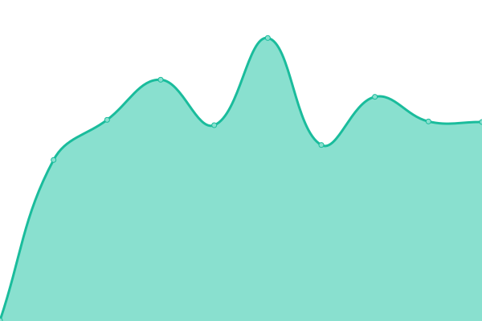

# [📈 Live Status](https://r2fo.github.io/upptime): <!--live status--> **🟧 Partial outage**

This repository contains the open-source uptime monitor and status page for [r2fo](r4fo.com), powered by [Upptime](https://github.com/upptime/upptime).

With [Upptime](https://upptime.js.org), you can get your own unlimited and free uptime monitor and status page, powered entirely by a GitHub repository. We use [Issues](https://github.com/r2fo/upptime/issues) as incident reports, [Actions](https://github.com/r2fo/upptime/actions) as uptime monitors, and [Pages](https://r2fo.github.io/upptime) for the status page.

<!--start: status pages-->
<!-- This summary is generated by Upptime (https://github.com/upptime/upptime) -->
<!-- Do not edit this manually, your changes will be overwritten -->
<!-- prettier-ignore -->
| URL | Status | History | Response Time | Uptime |
| --- | ------ | ------- | ------------- | ------ |
|  [Homepage](https://r4fo.com) | 🟩 Up | [homepage.yml](https://github.com/r2fo/upptime/commits/HEAD/history/homepage.yml) | 

 134ms
     
 | 

<a href="https://status.r4fo.com/history/homepage">100.00%</a>
    

|  [SearXNG](https://search.r4fo.com) | 🟩 Up | [sear-xng.yml](https://github.com/r2fo/upptime/commits/HEAD/history/sear-xng.yml) | 

 159ms
     
 | 

<a href="https://status.r4fo.com/history/sear-xng">100.00%</a>
    

|  [MiniSearch](https://minisearch.r4fo.com) | 🟥 Down | [mini-search.yml](https://github.com/r2fo/upptime/commits/HEAD/history/mini-search.yml) | 

 132ms
     
 | 

<a href="https://status.r4fo.com/history/mini-search">0.00%</a>
    

|  [Whoogle](https://whoogle.r4fo.com) | 🟩 Up | [whoogle.yml](https://github.com/r2fo/upptime/commits/HEAD/history/whoogle.yml) | 

 277ms
     
 | 

<a href="https://status.r4fo.com/history/whoogle">100.00%</a>
    

|  [RedLib](https://redlib.r4fo.com) | 🟩 Up | [red-lib.yml](https://github.com/r2fo/upptime/commits/HEAD/history/red-lib.yml) | 

 545ms
     
 | 

<a href="https://status.r4fo.com/history/red-lib">100.00%</a>
    

|  [Nitter](https://nitter.r4fo.com) | 🟥 Down | [nitter.yml](https://github.com/r2fo/upptime/commits/HEAD/history/nitter.yml) | 

 182ms
     
 | 

<a href="https://status.r4fo.com/history/nitter">0.00%</a>
    

|  [GotHub](https://gothub.r4fo.com/about) | 🟩 Up | [got-hub.yml](https://github.com/r2fo/upptime/commits/HEAD/history/got-hub.yml) | 

 160ms
     
 | 

<a href="https://status.r4fo.com/history/got-hub">100.00%</a>
    

|  [Anonymous Overflow](https://overflow.r4fo.com) | 🟩 Up | [anonymous-overflow.yml](https://github.com/r2fo/upptime/commits/HEAD/history/anonymous-overflow.yml) | 

 132ms
     
 | 

<a href="https://status.r4fo.com/history/anonymous-overflow">100.00%</a>
    

|  [Wikiless](https://wikiless.r4fo.com) | 🟩 Up | [wikiless.yml](https://github.com/r2fo/upptime/commits/HEAD/history/wikiless.yml) | 

 238ms
     
 | 

<a href="https://status.r4fo.com/history/wikiless">98.65%</a>
    

|  [Scribe](https://scribe.r4fo.com) | 🟥 Down | [scribe.yml](https://github.com/r2fo/upptime/commits/HEAD/history/scribe.yml) | 

 0ms
     
 | 

<a href="https://status.r4fo.com/history/scribe">0.00%</a>
    

|  [BreezeWiki](https://breezewiki.r4fo.com) | 🟩 Up | [breeze-wiki.yml](https://github.com/r2fo/upptime/commits/HEAD/history/breeze-wiki.yml) | 

 118ms
     
 | 

<a href="https://status.r4fo.com/history/breeze-wiki">100.00%</a>
    

|  [Quetre](https://quetre.r4fo.com) | 🟩 Up | [quetre.yml](https://github.com/r2fo/upptime/commits/HEAD/history/quetre.yml) | 

 165ms
     
 | 

<a href="https://status.r4fo.com/history/quetre">100.00%</a>
    

|  [LibremDB](https://libremdb.r4fo.com) | 🟥 Down | [librem-db.yml](https://github.com/r2fo/upptime/commits/HEAD/history/librem-db.yml) | 

 133ms
     
 | 

<a href="https://status.r4fo.com/history/librem-db">100.00%</a>
    

|  [Mozhi](https://mozhi.r4fo.com) | 🟩 Up | [mozhi.yml](https://github.com/r2fo/upptime/commits/HEAD/history/mozhi.yml) | 

 183ms
     
 | 

<a href="https://status.r4fo.com/history/mozhi">100.00%</a>
    

|  [NL1](144.21.35.84) | 🟩 Up | [nl-1.yml](https://github.com/r2fo/upptime/commits/HEAD/history/nl-1.yml) | 

 123ms
     
 | 

<a href="https://status.r4fo.com/history/nl-1">14.41%</a>
    

|  [NL2](158.178.150.161) | 🟥 Down | [nl-2.yml](https://github.com/r2fo/upptime/commits/HEAD/history/nl-2.yml) | 

 0ms
     
 | 

<a href="https://status.r4fo.com/history/nl-2">100.00%</a>
    

|  [NYC1](193.38.248.237) | 🟩 Up | [nyc-1.yml](https://github.com/r2fo/upptime/commits/HEAD/history/nyc-1.yml) | 

 30ms
     
 | 

<a href="https://status.r4fo.com/history/nyc-1">100.00%</a>
    

<!--end: status pages-->

[**Visit our status website →**](https://r2fo.github.io/upptime)

## 📄 License

- Powered by: [Upptime](https://github.com/upptime/upptime)
- Code: [MIT](./LICENSE) © [Anand Chowdhary](https://anandchowdhary.com), supported by [Pabio](https://pabio.com)
- Data in the `./history` directory: [Open Database License](https://opendatacommons.org/licenses/odbl/1-0/)
