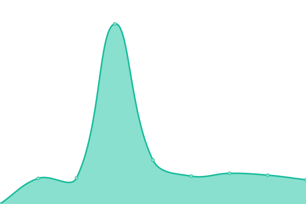

# [📈 Live Status](https://r2fo.github.io/upptime): <!--live status--> **🟩 All systems operational**

This repository contains the open-source uptime monitor and status page for [r2fo](r4fo.com), powered by [Upptime](https://github.com/upptime/upptime).

With [Upptime](https://upptime.js.org), you can get your own unlimited and free uptime monitor and status page, powered entirely by a GitHub repository. We use [Issues](https://github.com/r2fo/upptime/issues) as incident reports, [Actions](https://github.com/r2fo/upptime/actions) as uptime monitors, and [Pages](https://r2fo.github.io/upptime) for the status page.

<!--start: status pages-->
<!-- This summary is generated by Upptime (https://github.com/upptime/upptime) -->
<!-- Do not edit this manually, your changes will be overwritten -->
<!-- prettier-ignore -->
| URL | Status | History | Response Time | Uptime |
| --- | ------ | ------- | ------------- | ------ |
|  [r4fo.com](https://r4fo.com) | 🟩 Up | [r4fo-com.yml](https://github.com/r2fo/upptime/commits/HEAD/history/r4fo-com.yml) | 

 604ms
     
 | 

<a href="https://status.r4fo.com/history/r4fo-com">100.00%</a>
    

|  NL1 (server - hosting) | 🟩 Up | [nl-1-server-hosting.yml](https://github.com/r2fo/upptime/commits/HEAD/history/nl-1-server-hosting.yml) | 

 134ms
     
 | 

<a href="https://status.r4fo.com/history/nl-1-server-hosting">100.00%</a>
    

|  NL2 (server - BGP) | 🟩 Up | [nl-2-server-bgp.yml](https://github.com/r2fo/upptime/commits/HEAD/history/nl-2-server-bgp.yml) | 

 135ms
     
 | 

<a href="https://status.r4fo.com/history/nl-2-server-bgp">100.00%</a>
    

|  DE1 (server - BGP) | 🟩 Up | [de-1-server-bgp.yml](https://github.com/r2fo/upptime/commits/HEAD/history/de-1-server-bgp.yml) | 

 140ms
     
 | 

<a href="https://status.r4fo.com/history/de-1-server-bgp">100.00%</a>
    

|  [SearXNG](https://search.r4fo.com) | 🟩 Up | [sear-xng.yml](https://github.com/r2fo/upptime/commits/HEAD/history/sear-xng.yml) | 

 488ms
     
 | 

<a href="https://status.r4fo.com/history/sear-xng">100.00%</a>
    

|  [MiniSearch](https://minisearch.r4fo.com) | 🟩 Up | [mini-search.yml](https://github.com/r2fo/upptime/commits/HEAD/history/mini-search.yml) | 

 460ms
     
 | 

<a href="https://status.r4fo.com/history/mini-search">100.00%</a>
    

|  [Whoogle](https://whoogle.r4fo.com) | 🟩 Up | [whoogle.yml](https://github.com/r2fo/upptime/commits/HEAD/history/whoogle.yml) | 

 451ms
     
 | 

<a href="https://status.r4fo.com/history/whoogle">100.00%</a>
    

|  [RedLib](https://redlib.r4fo.com) | 🟩 Up | [red-lib.yml](https://github.com/r2fo/upptime/commits/HEAD/history/red-lib.yml) | 

 233ms
     
 | 

<a href="https://status.r4fo.com/history/red-lib">100.00%</a>
    

|  [Nitter](https://nitter.r4fo.com) | 🟩 Up | [nitter.yml](https://github.com/r2fo/upptime/commits/HEAD/history/nitter.yml) | 

 250ms
     
 | 

<a href="https://status.r4fo.com/history/nitter">100.00%</a>
    

|  [GotHub](https://gothub.r4fo.com/about) | 🟩 Up | [got-hub.yml](https://github.com/r2fo/upptime/commits/HEAD/history/got-hub.yml) | 

 481ms
     
 | 

<a href="https://status.r4fo.com/history/got-hub">100.00%</a>
    

|  [Anonymous Overflow](https://overflow.r4fo.com) | 🟩 Up | [anonymous-overflow.yml](https://github.com/r2fo/upptime/commits/HEAD/history/anonymous-overflow.yml) | 

 449ms
     
 | 

<a href="https://status.r4fo.com/history/anonymous-overflow">100.00%</a>
    

|  [Wikiless](https://wikiless.r4fo.com) | 🟩 Up | [wikiless.yml](https://github.com/r2fo/upptime/commits/HEAD/history/wikiless.yml) | 

 461ms
     
 | 

<a href="https://status.r4fo.com/history/wikiless">100.00%</a>
    

|  [Scribe](https://scribe.r4fo.com) | 🟩 Up | [scribe.yml](https://github.com/r2fo/upptime/commits/HEAD/history/scribe.yml) | 

 475ms
     
 | 

<a href="https://status.r4fo.com/history/scribe">100.00%</a>
    

|  [BreezeWiki](https://breezewiki.r4fo.com) | 🟩 Up | [breeze-wiki.yml](https://github.com/r2fo/upptime/commits/HEAD/history/breeze-wiki.yml) | 

 468ms
     
 | 

<a href="https://status.r4fo.com/history/breeze-wiki">100.00%</a>
    

|  [Quetre](https://quetre.r4fo.com) | 🟩 Up | [quetre.yml](https://github.com/r2fo/upptime/commits/HEAD/history/quetre.yml) | 

 439ms
     
 | 

<a href="https://status.r4fo.com/history/quetre">100.00%</a>
    

|  [LibremDB](https://libremdb.r4fo.com) | 🟩 Up | [librem-db.yml](https://github.com/r2fo/upptime/commits/HEAD/history/librem-db.yml) | 

 441ms
     
 | 

<a href="https://status.r4fo.com/history/librem-db">100.00%</a>
    

|  [Mozhi](https://mozhi.r4fo.com) | 🟩 Up | [mozhi.yml](https://github.com/r2fo/upptime/commits/HEAD/history/mozhi.yml) | 

 440ms
     
 | 

<a href="https://status.r4fo.com/history/mozhi">100.00%</a>
    

<!--end: status pages-->

[**Visit our status website →**](https://r2fo.github.io/upptime)

## 📄 License

- Powered by: [Upptime](https://github.com/upptime/upptime)
- Code: [MIT](./LICENSE) © [Anand Chowdhary](https://anandchowdhary.com), supported by [Pabio](https://pabio.com)
- Data in the `./history` directory: [Open Database License](https://opendatacommons.org/licenses/odbl/1-0/)
